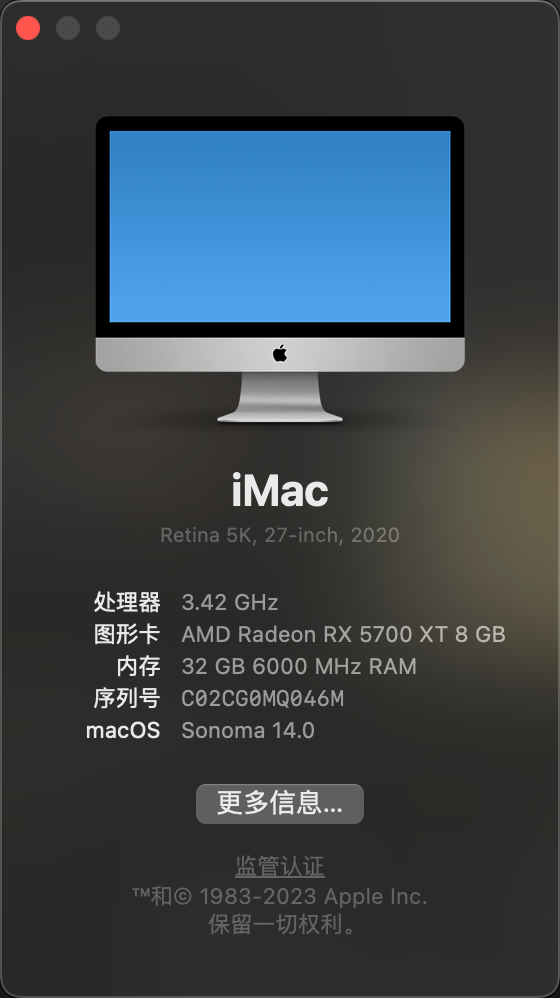
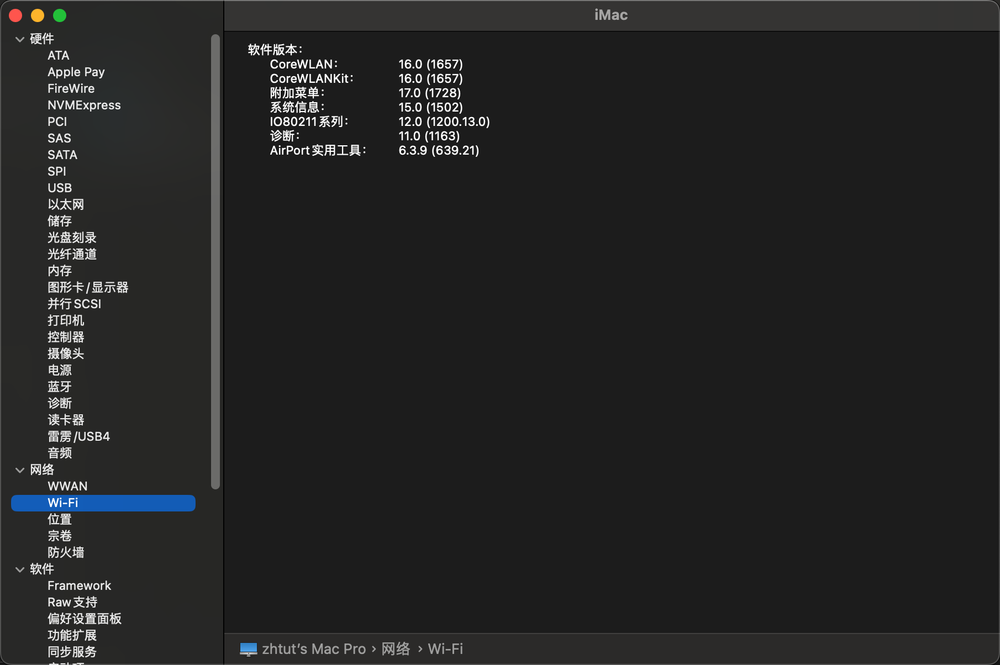
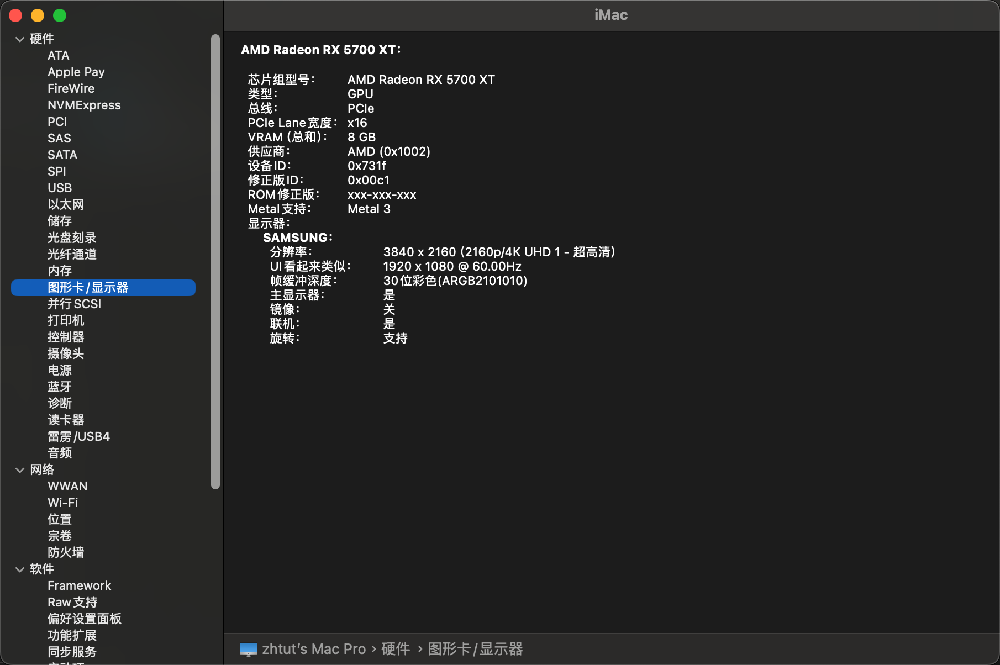
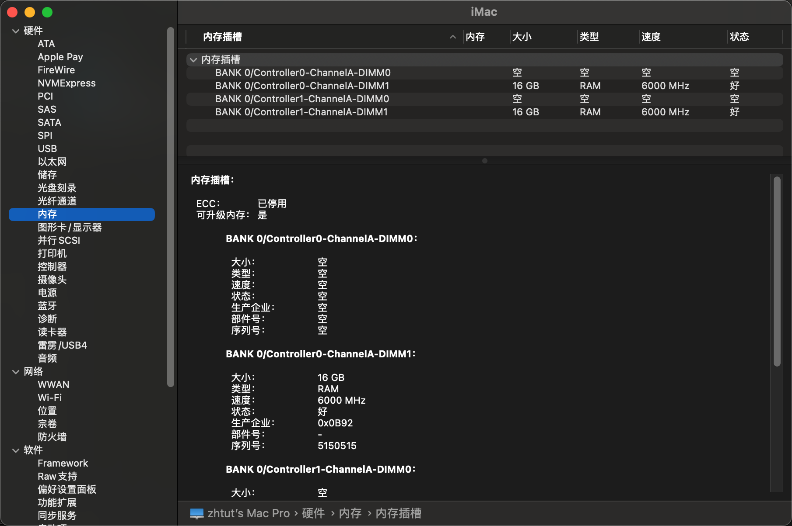
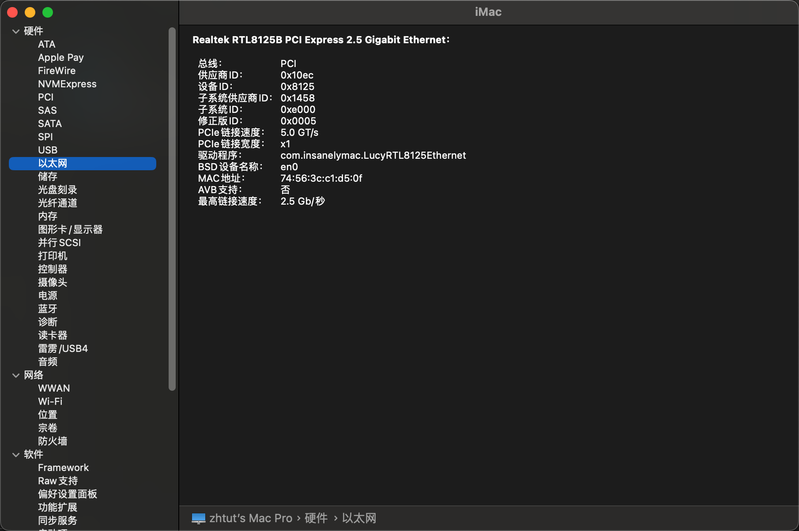
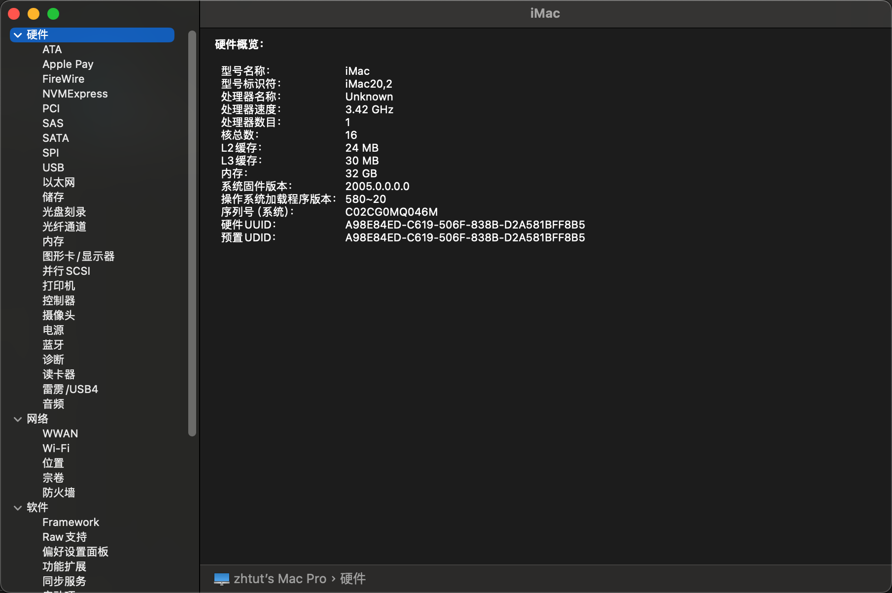
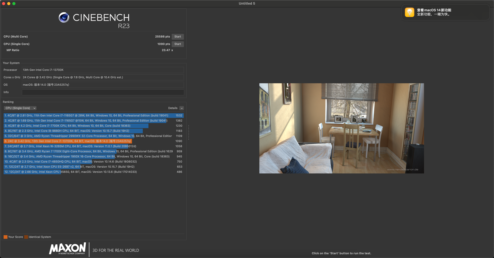
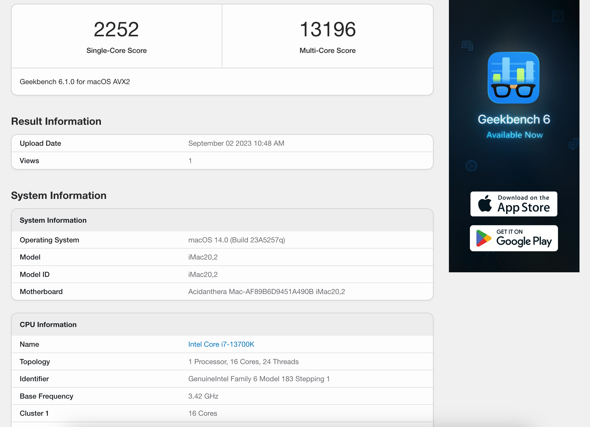
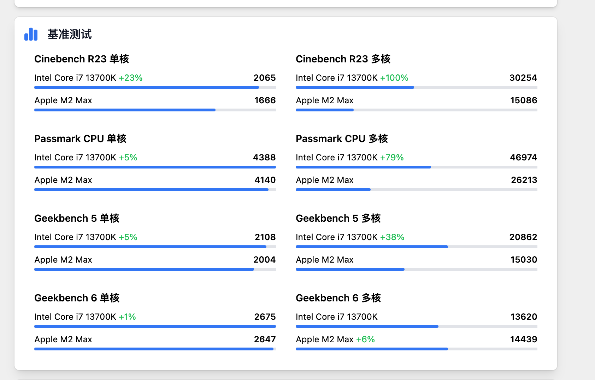

# OC_EFI_13700k_z790m_5700xt
我的黑苹果引导

## 配置
```
CPU: Intel i7-13700K
内存：金百达32g ddr5（16gx2）
主板：技嘉z790m Aorus elite 小雕d5
显卡：怒瑞玛 amd 5700xt 8g显存
声卡：Realtek ALC1220声卡
网卡：Realtek 8125网卡
wifi：intel ax210 pcie 无线网卡
```

## bios配置

## 装好效果







### 跑分
macOS14跑分下降很多，我之前在macOS13下，可以跑到差不多正常的水平，geekbench6 单核有2600，多核有1万6，和网上的一致，升级了macOS14之后，性能下降挺多




### Drivers作用
|Drivers|作用|
|----|----|
|ResetNvramEntry.efi|重置 nvram 使用，nvram 是主板上的一块小存储，mac 需要存储一些东西在里面|
|OpenRuntime.efi|主驱动|
|OpenCanopy.efi|主题相关的驱动，需要跟其他几个同一个版本，要不然可能有问题|
|HfsPlus.efi|识别 hfs 硬盘需要，不要使用 OpenHfsPlus，官方说 open 的比较慢|

### Kexts 作用
|Kexts|作用|
|----|----|
|WhateverGreen.kext|驱动显卡|
|VirtualSMC.kext|监控主文件|
|SMCSuperIO.kext||
|SMCRadeonGPU.kext|监控显卡温度|
|SMCProcessor.kext|监控cpu温度|
|RestrictEvents.kext|各种补丁|
|NVMeFix.kext|修复nvme|
|LucyRTL8125Ethernet.kext|驱动Realtek网卡|
|Lilu.kext|必须|
|IntelBTPatcher.kext|蓝牙补丁|
|IntelBluetoothFirmware.kext|蓝牙驱动|
|CpuTscSync.kext|cpu同步，不加可能会卡|
|CpuTopologyRebuild.kext|cpu核心识别|
|CPUFriendDataProvider.kext|cpu核心识别和超频|
|CPUFriend.kext|cpu核心识别和超频|
|BlueToolFixup.kext|修复蓝牙|
|AppleMCEReporterDisabler.kext||
|AppleIntelI210Ethernet.kext|驱动Realtek网卡|
|AppleALC.kext|模拟声卡为apple的声卡|
|AirportItlwm.kext|驱动 intel的wifi 使用|

## 问题
目前安装成功，但还有一些问题

### 蓝牙无法使用的问题
加入这三个驱动解决了，可以连接耳机
```
BlueToolFixup.kext
IntelBluetoothFirmware.kext
IntelBTPatcher.kext
```

### 启动慢的问题
重新按照教程收集了一遍文件，并且换成 release 模式的 opencore 解决了

### cpu 识别不正确的问题，识别到 intel8核i5了
之前搞 nas 系统，为了省电，把技嘉的模式，设定为禁用性能核心了，然后我在 windows 下一下，竟然也只有 8 核，换成 optional，然后再检查了下配置就解决了
升级到macOS14又出现这个问题了，暂时没有解决

### 以太网能驱动，但只有千兆
### wifi 不支持 802 ax wifi6 的协议
### 前置usb3接口有问题，速度非常慢
### 睡眠有问题，一段时间之后，系统进入睡眠，电源按钮没有灯，但cpu啥都还在转，而且无法唤醒，只能重启，主动点击睡眠能唤醒，但没有真的进入睡眠状态
### 隔空投送不能使用，在macOS13下能搜索到iPhone，但发送文件手机没反应，手机无法搜索到macOS
